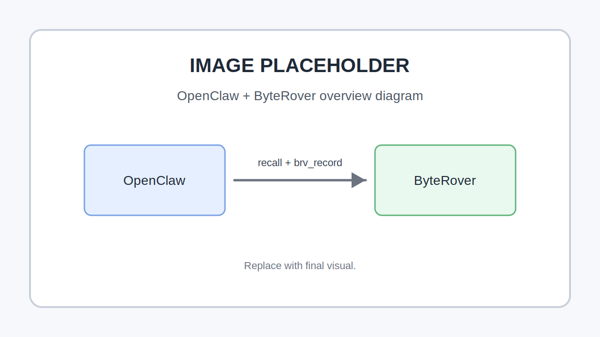
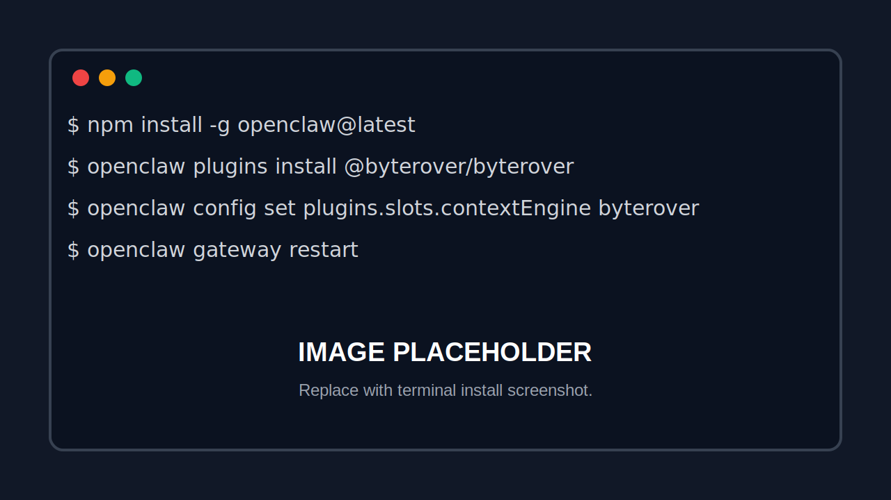
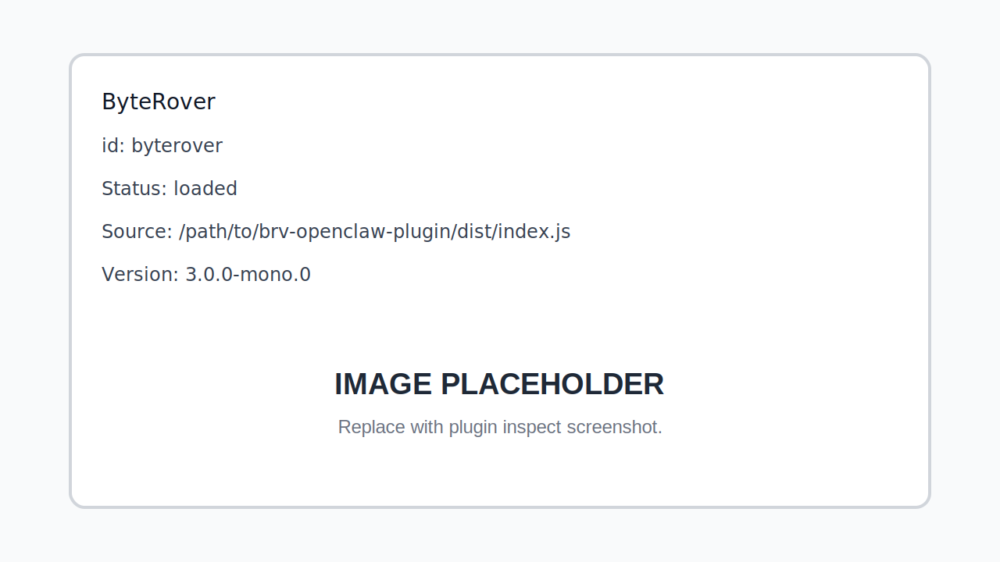
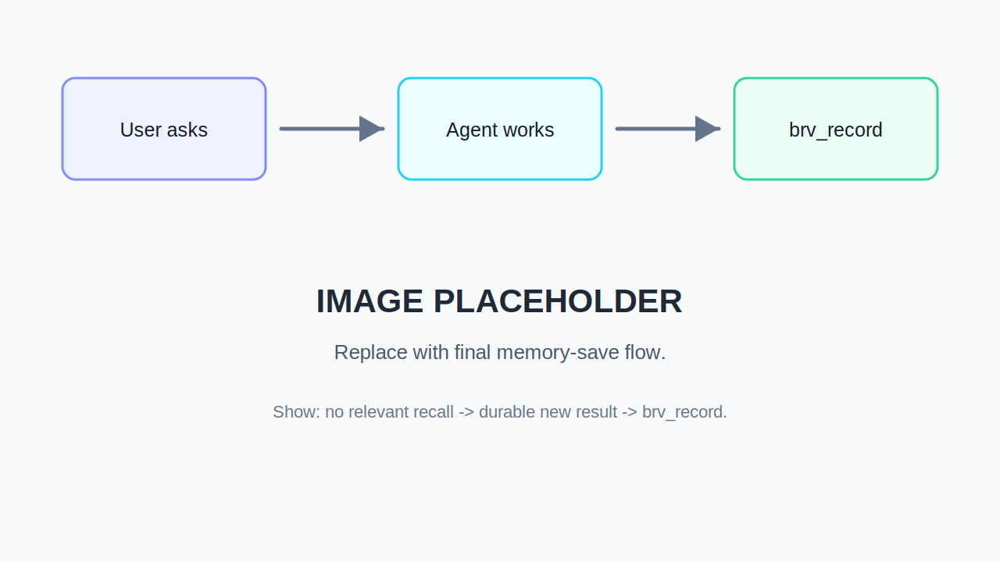

# ByteRover for OpenClaw: End-User Installation and Usage Guide

This guide explains how to install the ByteRover context-engine plugin for
OpenClaw, verify that it is active, and use it during normal OpenClaw sessions.

The plugin lets OpenClaw retrieve durable ByteRover memory before each agent
turn and gives the agent a `brv_record` tool for saving durable knowledge after
work is complete.

## Image Placeholders

Replace these placeholder images before publishing the guide.









## What Gets Installed

The installation has three parts:

1. OpenClaw CLI and gateway service.
2. ByteRover context-engine plugin.
3. Plugin configuration that sets `byterover` as OpenClaw's active
   `contextEngine`.

After setup, OpenClaw loads the plugin at gateway startup. The plugin recalls
ByteRover topics during `assemble` and registers the `brv_record` tool for
agent memory writes.

## Requirements

- macOS, Linux, or another environment supported by OpenClaw.
- Node.js 22 or newer.
- OpenClaw installed from npm.
- A ByteRover workspace/context tree available for the OpenClaw workspace you
  want agents to use.

Check the OpenClaw version:

```bash
openclaw --version
```

Check the gateway state:

```bash
openclaw status
```

## Clean OpenClaw Reinstall

Use this only when you want to remove local OpenClaw state and start fresh.
This removes OpenClaw config, local state, workspace data, and the gateway
service. Back up anything you need first.

```bash
openclaw backup create
openclaw uninstall --all --yes --non-interactive
npm uninstall -g openclaw
npm install -g openclaw@latest
```

Verify the new install:

```bash
which openclaw
openclaw --version
openclaw status
```

## Install From The Package

Use this when the plugin is published to npm.

```bash
openclaw plugins install @byterover/byterover
openclaw config set plugins.slots.contextEngine byterover
openclaw gateway restart
```

Verify:

```bash
openclaw plugins inspect byterover
openclaw config get plugins.slots.contextEngine
openclaw plugins doctor
```

Expected result:

- `plugins.slots.contextEngine` returns `byterover`.
- `openclaw plugins inspect byterover` shows `Status: loaded`.
- `openclaw plugins doctor` reports no plugin issues.

## Install By Local Link

Use this when testing a local checkout of the plugin.

```bash
cd /path/to/brv-openclaw-plugin
npm install
npm run build
openclaw plugins install --link /path/to/brv-openclaw-plugin
openclaw config set plugins.slots.contextEngine byterover
openclaw gateway restart
```

Linked installs point OpenClaw at the local plugin directory. Rebuild after
source changes:

```bash
cd /path/to/brv-openclaw-plugin
npm run build
openclaw gateway restart
```

Verify the linked path:

```bash
openclaw plugins inspect byterover
```

Expected install details include:

```text
Source: path
Source path: /path/to/brv-openclaw-plugin
Install path: /path/to/brv-openclaw-plugin
```

## Start Or Restart The Gateway

Install the gateway service if it is not installed:

```bash
openclaw gateway install --force
openclaw gateway start
```

Restart it after plugin changes:

```bash
openclaw gateway restart
```

Check that the gateway is reachable:

```bash
openclaw gateway status
```

The status should show:

```text
Runtime: running
Connectivity probe: ok
```

## Confirm ByteRover Is Loaded

Inspect the plugin:

```bash
openclaw plugins inspect byterover
```

Check the active context engine:

```bash
openclaw config get plugins.slots.contextEngine
```

Check gateway logs:

```bash
tail -n 200 ~/Library/Logs/openclaw/gateway.log | grep byterover
```

Expected log line:

```text
[plugins] [byterover] Plugin loaded (mono context-engine + brv_record tool)
```

During agent turns with relevant memory, logs may include:

```text
[plugins] [byterover] assemble: 1 hit(s) for query "..." (cwd=...)
```

## How Users Should Use It

Use OpenClaw normally. The plugin works in the background.

Before each agent response, the plugin:

1. Extracts the latest user query.
2. Searches the ByteRover context tree for relevant topics.
3. Injects matching topics into the OpenClaw system prompt.

After the agent finishes durable work, the agent should call `brv_record` when
there is something worth preserving.

Good things to record:

- Decisions and the reason behind them.
- Project rules and conventions.
- Bug symptoms, root causes, and fixes.
- Non-obvious gotchas and constraints.
- Reusable workflow or design patterns.
- Facts the user explicitly asked the agent to remember.
- Durable new results when ByteRover recall had no relevant topic for the
  user's question.

Things the agent should not record:

- General explanations or definitions the user did not ask to remember.
- Details already obvious from code, git history, or files just edited.
- Greetings, acknowledgements, and clarifying questions.
- Knowledge already covered by retrieved ByteRover context.
- Unrelated retrieved context.

## Example User Prompts

Ask a normal question:

```text
How does our authentication flow work?
```

If ByteRover has relevant context, the agent should use it and cite the topic
path in its response.

Ask the agent to remember a durable fact:

```text
Remember that this project uses TypeScript strict mode for all new services.
```

The agent should save a ByteRover topic with `brv_record`.

Ask for new work:

```text
Debug why the OpenClaw gateway is not loading the ByteRover plugin.
```

If there is no relevant ByteRover topic, the agent should do the work normally.
After it finds a durable root cause or fix, it should save that result with
`brv_record`.

## Plugin Configuration

Minimal config:

```json
{
  "plugins": {
    "slots": {
      "contextEngine": "byterover"
    },
    "entries": {
      "byterover": {
        "enabled": true,
        "config": {}
      }
    }
  }
}
```

Optional config:

```json
{
  "plugins": {
    "entries": {
      "byterover": {
        "enabled": true,
        "config": {
          "cwd": "/path/to/workspace",
          "recallLimit": 5
        }
      }
    }
  }
}
```

Options:

| Option | Purpose |
| --- | --- |
| `cwd` | Workspace directory used when OpenClaw session workspace resolution is unavailable. |
| `recallLimit` | Maximum number of ByteRover recall hits. Defaults to `5`. |
| `recallScript` | Deprecated compatibility option. Ignored by the mono plugin. |
| `recallTimeoutMs` | Deprecated compatibility option. Ignored by the mono plugin. |
| `queryTimeoutMs` | Deprecated compatibility option. Ignored by the mono plugin. |

## Troubleshooting

### Plugin Is Not Listed

Run:

```bash
openclaw plugins list
```

If `byterover` is missing, install it again:

```bash
openclaw plugins install @byterover/byterover
```

For a local checkout:

```bash
openclaw plugins install --link /path/to/brv-openclaw-plugin
```

### Plugin Is Listed But Not Active

Set the context-engine slot:

```bash
openclaw config set plugins.slots.contextEngine byterover
openclaw gateway restart
```

### Plugin Does Not Load

Run:

```bash
openclaw plugins doctor
openclaw plugins inspect byterover
```

For local linked installs, rebuild the plugin:

```bash
cd /path/to/brv-openclaw-plugin
npm run build
openclaw gateway restart
```

### No ByteRover Context Appears

This usually means no relevant topic exists for the current question, or the
workspace is not connected to the expected ByteRover context tree.

Check gateway logs:

```bash
tail -n 200 ~/Library/Logs/openclaw/gateway.log | grep byterover
```

Then ask a question that should match known ByteRover memory. If no relevant
topic exists, the agent should answer normally and record any durable new
result after the work.

### Agent Does Not Save Memory

The plugin does not auto-save every turn. The agent saves memory only by using
the `brv_record` tool. Ask explicitly if needed:

```text
Please remember this project rule in ByteRover.
```

## Disable Or Remove

Disable the plugin:

```bash
openclaw plugins disable byterover
openclaw config set plugins.slots.contextEngine legacy
openclaw gateway restart
```

Uninstall the plugin:

```bash
openclaw plugins uninstall byterover
openclaw config set plugins.slots.contextEngine legacy
openclaw gateway restart
```

## Screenshot Checklist

Replace the placeholders with screenshots before publishing:

- OpenClaw status showing gateway reachable.
- Plugin list showing ByteRover enabled.
- Plugin inspect output showing the linked or package install path.
- Gateway log line showing `Plugin loaded`.
- Example conversation where the agent recalls ByteRover context.
- Example conversation where the agent saves a durable result with
  `brv_record`.
